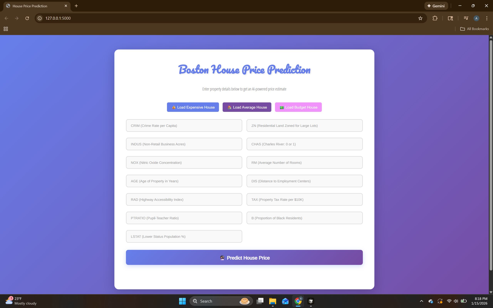

# Boston House Price Prediction using Machine Learning



## Project Overview

This repository contains a predictive analytics solution designed to estimate property values in the Boston metropolitan area. Leveraging the renowned Boston Housing dataset, the implementation constructs an intelligent pricing model by examining key property characteristics including neighborhood safety metrics, dwelling size, transportation accessibility, and various socio-economic indicators. The solution employs CatBoostRegressor, a gradient boosting framework, to deliver precise price forecasts. Throughout the development process, comprehensive data exploration, feature engineering, and model optimization techniques were applied. The final model serves as a practical decision-support tool for real estate stakeholders seeking data-driven price estimations.

## Features

✨ **Modern Web Interface**
- Beautiful gradient design with responsive layout
- Two-column form layout for better user experience
- Intuitive input fields with descriptive placeholders
- Real-time form validation

🚀 **Quick Start Options**
- Pre-configured sample data buttons for testing:
  - 💰 Load Expensive House
  - 🏠 Load Average House  
  - 💵 Load Budget House

💡 **User-Friendly Features**
- Formatted price display (e.g., "$250K ($250,000)")
- Clear error messages and validation
- Mobile-responsive design
- Fast prediction results

🔌 **API Support**
- RESTful API endpoint for programmatic access
- JSON-based request/response format

## Technology Stack

This project is built using the following technologies and libraries:

- **Flask** - Web framework for application deployment
- **pandas** - Data manipulation and analysis
- **numpy** - Numerical computing operations
- **matplotlib** - Data visualization
- **scikit-learn** - Machine learning utilities and preprocessing
- **catboost** - Gradient boosting regression algorithm
- **gunicorn** - Production WSGI HTTP server

## Installation & Setup

Follow these instructions to set up and run the project on your local machine:

### Step 1: Clone the Repository

```bash
git clone <your-repository-url>
cd House-Price-Prediction
```

### Step 2: Install Dependencies

Install all required Python packages using pip:

```bash
pip install -r requirements.txt
```

**Important Note**: This project requires NumPy < 2.0 for compatibility with the pickle files. If you encounter version conflicts, use:

```bash
pip install "numpy<2.0" "scikit-learn>=1.0.0,<1.4"
```

### Step 3: Generate Model Files (Optional)

If the model files (`housepred.pkl` and `scaler.pkl`) are not present, execute the Jupyter notebook (`Boston House Price Prediction.ipynb`) to train the model and generate the necessary `.pkl` files required for deployment. Once the notebook runs successfully, you'll have both the trained model and scaler ready for the web application.

### Step 4: Run the Application

Start the Flask development server:

```bash
python app.py
```

The application will be available at `http://localhost:5000` or `http://127.0.0.1:5000`

### Step 5: Use the Web Interface

1. Open your browser and navigate to `http://localhost:5000`
2. Optionally click one of the sample data buttons to quickly fill the form
3. Enter property details in the form fields (all fields include helpful placeholders)
4. Click "🔮 Predict House Price" to get your prediction
5. View the formatted price prediction displayed below the form

## Dataset Information

### Boston Housing Dataset

The dataset originates from the `sklearn.datasets` library and comprises 506 property records from the Boston area. Each record contains 13 quantitative attributes that characterize different aspects of residential properties. The dataset's target variable represents the median home value in thousands of dollars for owner-occupied residences.

### Feature Description

The model analyzes the following 13 input features:

1. **CRIM** - Crime rate per capita within the town
2. **ZN** - Percentage of residential land allocated for lots exceeding 25,000 square feet
3. **INDUS** - Percentage of non-retail commercial acreage per town
4. **CHAS** - Binary indicator for Charles River proximity (1 = adjacent to river, 0 = otherwise)
5. **NOX** - Nitric oxides concentration measured in parts per 10 million
6. **RM** - Mean number of rooms per residential unit
7. **AGE** - Percentage of owner-occupied homes constructed before 1940
8. **DIS** - Weighted distance measurements to five major Boston employment hubs
9. **RAD** - Accessibility index for radial highway systems
10. **TAX** - Property tax rate per $10,000 of full assessed value
11. **PTRATIO** - Average student-to-teacher ratio within the town's schools
12. **B** - Calculated as 1000(Bk - 0.63)² where Bk represents the proportion of African American residents by town
13. **LSTAT** - Percentage of residents classified as lower socioeconomic status

### Target Variable

- **MEDV** - Median home value expressed in thousands of dollars ($1000s)

## Data Preprocessing Pipeline

Prior to model training, the raw dataset undergoes systematic preprocessing. The workflow begins by extracting the feature matrix (X) and target vector (y) from the dataset. Feature normalization is accomplished using scikit-learn's `StandardScaler` transformer, which standardizes all input variables to have zero mean and unit variance. This scaling ensures that features with larger magnitudes don't dominate the learning process. The dataset is subsequently partitioned into training and validation subsets following an 80-20 split convention.

## Model Development & Performance Assessment

The predictive model is constructed using the CatBoostRegressor framework. Model development involves several critical steps: feature preparation, algorithm selection, and hyperparameter optimization. A RandomizedSearchCV strategy is implemented to systematically explore the hyperparameter space, with optimal configuration selection guided by 5-fold cross-validation performance. The final model is fitted on the training partition using the best-performing hyperparameter combination. Model validation occurs on the held-out test set, where predictions are benchmarked against actual home values using the R² (coefficient of determination) evaluation metric.

**Primary Algorithm**: CatBoost Regression

## Web Application Features

The project features a modern Flask web service with an intuitive interface for price prediction. Upon server initialization, the application deserializes the trained model from `housepred.pkl` and the preprocessing scaler from `scaler.pkl`.

### Web Form Interface

The main interface provides:
- **Two-column responsive layout** - Optimized for desktop and mobile viewing
- **Descriptive placeholders** - Each field shows its full name and description (e.g., "CRIM (Crime Rate per Capita)")
- **Sample data buttons** - Quick-fill options for testing with realistic property values
- **Formatted predictions** - Results displayed as "$250K ($250,000)" for clarity
- **Error handling** - User-friendly error messages for invalid inputs

### REST API Endpoint

For programmatic access, use the `/predict_api` endpoint:

**Request Example:**
```bash
curl -X POST http://localhost:5000/predict_api \
  -H "Content-Type: application/json" \
  -d '{
    "data": {
      "CRIM": 0.00632,
      "ZN": 18.0,
      "INDUS": 2.31,
      "CHAS": 0,
      "NOX": 0.538,
      "RM": 6.575,
      "Age": 65.2,
      "DIS": 4.09,
      "RAD": 1,
      "TAX": 296.0,
      "PTRATIO": 15.3,
      "B": 396.9,
      "LSTAT": 4.98
    }
  }'
```

**Response Example:**
```json
{
  "prediction": 250.5,
  "formatted_price": "$250.50K ($250,500)"
}
```

## Troubleshooting

### NumPy Version Compatibility

If you encounter errors like `numpy.dtype size changed`, this indicates a version mismatch. The pickle files were created with NumPy 1.x:

**Solution:**
```bash
pip install "numpy<2.0" "scikit-learn>=1.0.0,<1.4"
```

### Scikit-learn Compatibility

If you see `AttributeError: Can't get attribute '_passthrough_scorer'`, downgrade scikit-learn:

**Solution:**
```bash
pip install scikit-learn==1.0.2
```

### Model Files Not Found

If `housepred.pkl` or `scaler.pkl` are missing:

**Solution:** Run the Jupyter notebook (`Boston House Price Prediction.ipynb`) to generate the model files.

### Port Already in Use

If port 5000 is already in use:

**Solution:** Modify `app.py` to use a different port:
```python
app.run(debug=True, port=5001)
```

### Module Not Found

If you get import errors:

**Solution:** Ensure all dependencies are installed:
```bash
pip install -r requirements.txt
```

## How to Contribute

The open-source ecosystem thrives on collaborative innovation. Your contributions, whether through bug reports, feature suggestions, or code improvements, are warmly welcomed and highly valued.

To contribute:

1. Fork this repository to your GitHub account
2. Create a new branch for your feature or fix
3. Make your modifications and test thoroughly
4. Commit your changes with clear, descriptive messages
5. Push your branch and initiate a pull request

For enhancement ideas, feel free to open an issue tagged with "enhancement". If you find this project useful, consider giving it a star!

## License

This project is licensed under the GNU General Public License v3.0. For complete license details, refer to the `LICENSE` file.

## Project Structure

```
Boston_house_pred/
├── app.py                              # Flask web application
├── requirements.txt                    # Python dependencies
├── housepred.pkl                       # Trained CatBoost model
├── scaler.pkl                          # Data preprocessing scaler
├── Boston House Price Prediction.ipynb # Model training notebook
├── templates/
│   └── home.html                      # Web interface template
├── Output/
│   └── image.png                      # Project screenshot
├── Procfile                           # Heroku deployment config
├── netlify.toml                       # Netlify deployment config
├── .gitignore                         # Git ignore rules
└── README.md                          # Project documentation
```

## Screenshots


The web interface features a modern gradient design with a clean two-column form layout, making it easy to input property details and get instant price predictions.

## Deployment

### Heroku Deployment

The project includes a `Procfile` for easy Heroku deployment:

```bash
gunicorn app:app
```

### Netlify Deployment

Configuration for Netlify is available in `netlify.toml`.

**Note:** For production deployment, make sure to set `debug=False` in `app.py` for security.

## Credits & References

The foundation of this work stems from the Boston House Price Prediction challenges and datasets available on Kaggle. We extend gratitude to the developers and maintainers of the open-source Python libraries that made this project possible.

## Recent Updates

- ✅ Modernized UI with gradient design and responsive layout
- ✅ Added sample data buttons for quick testing
- ✅ Implemented two-column form layout for better UX
- ✅ Enhanced placeholders with full feature descriptions
- ✅ Improved price formatting for readability
- ✅ Added comprehensive error handling
- ✅ Fixed NumPy/scikit-learn version compatibility issues
- ✅ Updated documentation with troubleshooting guide
